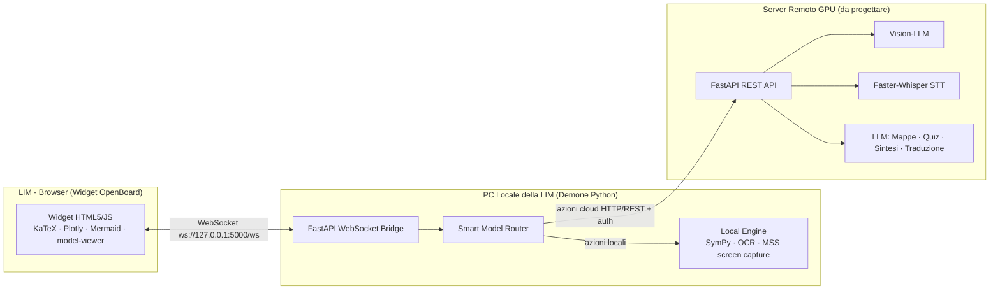

# AI-Enhanced OpenBoard Ecosystem — LIM-AI Copilot
## Documento di Progetto e Piano di Implementazione (Technical Spec + Scrum Delivery Plan)

| Campo | Valore |
|---|---|
| Versione documento | 1.0 |
| Data | 23 Luglio 2026 |
| Ruolo redattore | Senior Full-Stack & AI Integration Engineer (Hybrid Edge-Cloud, EdTech) |
| Stato | Draft per validazione Product Owner / Dirigenza scolastica |
| Fonti analizzate | `local_bridge.py`, `index.html` (PoC forniti), SRS v2.0 |

---

## Indice

1. [Executive Summary](#1-executive-summary)
2. [Analisi del Proof of Concept Esistente](#2-analisi-del-proof-of-concept-esistente)
3. [Architettura di Sistema](#3-architettura-di-sistema)
4. [Stack Tecnologico Completo](#4-stack-tecnologico-completo)
5. [Specifiche dei Componenti](#5-specifiche-dei-componenti)
6. [Protocollo di Comunicazione (Message Contract)](#6-protocollo-di-comunicazione-message-contract)
7. [Smart Model Router — Regole ed Estensioni](#7-smart-model-router--regole-ed-estensioni)
8. [Sicurezza e Privacy](#8-sicurezza-e-privacy)
9. [Requisiti Non Funzionali e Verifica](#9-requisiti-non-funzionali-e-verifica)
10. [Testing & QA Strategy](#10-testing--qa-strategy)
11. [DevOps & Deployment](#11-devops--deployment)
12. [Rischi di Progetto e Mitigazioni](#12-rischi-di-progetto-e-mitigazioni)
13. [Team & Ruoli](#13-team--ruoli)
14. [Piano di Rilascio — Metodologia Scrum](#14-piano-di-rilascio--metodologia-scrum)
15. [Roadmap Post-MVP](#15-roadmap-post-mvp)
16. [Appendice](#16-appendice)

---

## 1. Executive Summary

**LIM-AI Copilot** trasforma OpenBoard in un copilota didattico ibrido Edge-Cloud per le Lavagne Interattive Multimediali (LIM) delle scuole italiane. L'obiettivo non è sostituire il docente, ma renderlo più efficace ed inclusivo: calcoli e OCR istantanei sul PC locale (spesso datato), intelligenza pesante (visione, trascrizione, generazione contenuti) delegata a un server cloud con GPU, e continuità didattica garantita anche quando la connessione scolastica cade.

Tre principi guida attraversano l'intero documento:
- **Latenza come requisito critico**: nulla che riguardi l'interazione diretta in classe deve percepirsi come "in attesa".
- **Degradazione morbida, mai un errore bloccante**: se il cloud non risponde, la lavagna continua a funzionare con funzionalità di base.
- **Invisibilità del software**: il valore per il docente è didattico, non tecnico; l'interfaccia non deve mai interrompere la lezione con popup o crash.

Questo documento copre l'intero ciclo di vita tecnico del progetto e lo suddivide in sprint Scrum eseguibili.

---

## 2. Analisi del Proof of Concept Esistente

Il PoC fornito (`local_bridge.py` per il demone e `index.html` per il widget) è concettualmente solido — router, macchina a stati di connessione, fallback — ma **non è nello stato in cui può essere eseguito**. Di seguito l'elenco dei problemi effettivamente riscontrati nel codice, verificati riga per riga, con priorità di correzione. Questa sezione esiste proprio per "minimizzare errori e allucinazioni": ogni voce è ancorata al codice reale, non a supposizioni.

| # | Problema riscontrato | Dove | Impatto | Fix proposto | Priorità |
|---|---|---|---|---|---|
| 1 | **URL malformati**: tutti gli URL (`REMOTE_SERVER_URL`, endpoint `/health`, e ogni `href`/`src` delle CDN in `index.html`) sono salvati come stringa in **sintassi Markdown** (`"[http://...](http://...)"`) invece che come URL puro | `local_bridge.py` righe 13, 75; `index.html` righe 7,8,10,12,14 | **Bloccante**: `httpx` solleva errore su schema URL non valido; il browser non carica nessuna libreria esterna (KaTeX, Plotly, Mermaid, model-viewer, font) | Rimuovere la sintassi `[testo](url)` e lasciare l'URL puro. Verosimilmente un artefatto di copia-incolla da una chat/editor che renderizza i link in Markdown | 🔴 Bloccante |
| 2 | **`fast_ocr` mappato ma non gestito**: la `ROUTING_TABLE` instrada `fast_ocr` verso `LOCAL`, ma il blocco `if target == RouteTarget.LOCAL` gestisce solo `action == "sympy_math"` | `local_bridge.py` righe 25-26, 91-96 | Una richiesta `fast_ocr` viene instradata correttamente ma **non riceve mai risposta** (nessun errore, nessun log utile per il widget) | Aggiungere il branch dedicato con l'`OCREngine` (da sviluppare, vedi Sprint 2) | 🔴 Alta |
| 3 | **Simbolo SymPy inutilizzato**: `x = sp.Symbol("x")` è dichiarato ma mai referenziato; `sp.sympify()` interpreta comunque autonomamente le variabili nella stringa | `local_bridge.py` riga 43 | Codice morto; può generare falsa impressione che il dominio sia limitato alla sola variabile `x` | Rimuovere la riga, oppure usarla esplicitamente se si vuole vincolare il dominio simbolico (es. validazione) | 🟡 Media |
| 4 | **Configurazione hardcoded**: IP del server remoto duplicato in due punti del codice, nessuna variabile d'ambiente | `local_bridge.py` righe 13, 75 | Impossibile distribuire il demone su scuole diverse senza modificare il codice sorgente | Spostare in `config.yaml`, editabile tramite l'interfaccia di setup dedicata (§5.4) invece che a mano; derivare l'URL di health-check dalla stessa base di `REMOTE_SERVER_URL` | 🟡 Media |
| 5 | **Nessuna autenticazione daemon → server remoto**: la POST verso `/api/v1/analyze` non porta alcun header di autenticazione | `local_bridge.py` riga 101 | Se il server remoto è raggiungibile oltre la rete scolastica locale, è esposto senza controllo accessi | Introdurre API key / bearer token per istituto (vedi §8) | 🟠 Alta (sicurezza) |
| 6 | **`mss` e `PIL.Image` importati ma non usati**: la cattura schermo dichiarata nei requisiti (<15ms) non è ancora implementata | `local_bridge.py` righe 5-6 | Nessun impatto immediato, ma segnala funzionalità dichiarata e non presente nel PoC | Da sviluppare in Sprint 2 (`screen_capture.py`) | 🟢 Bassa (nota di scope) |
| 7 | **`ws.onmessage` senza try/catch**: `JSON.parse(event.data)` non è protetto | `index.html`, funzione `ws.onmessage` | Un payload malformato dal daemon interrompe silenziosamente il flusso lato widget | Avvolgere in try/catch e gestire un tipo di messaggio `error` (vedi §6) | 🟡 Media |
| 8 | **Payload di richiesta statico**: `requestAction()` invia sempre `"2*x + 6 - 12"` indipendentemente dall'azione (anche per `concept_map` o `generate_quiz`, che richiedono un topic testuale, non un'espressione) | `index.html`, funzione `requestAction` | Il PoC dimostra solo il flusso matematico; le altre azioni non hanno ancora un input reale collegato | Costruire payload specifici per azione (vedi §6, schema messaggi) | 🟡 Media |
| 9 | **Gestione errori generica nel motore matematico**: eccezioni catturate ma non loggate, messaggio statico all'utente | `local_bridge.py`, `process_math` | Debug difficile in produzione | Aggiungere `logging` strutturato server-side, mantenendo il messaggio utente semplice | 🟢 Bassa |

> **Nota metodologica**: nessuna versione di libreria citata nel PoC (KaTeX 0.16.8, Plotly 2.24.1, Mermaid 10, model-viewer 3.1.1) è stata verificata come "ultima versione disponibile" in questo documento — vanno ricontrollate sulle rispettive changelog al momento dell'implementazione, per evitare di bloccare lo sviluppo su versioni potenzialmente superate o con CVE note.

---

## 3. Architettura di Sistema

Architettura Hybrid Edge-Cloud a tre livelli, così come definita nella specifica, qui dettagliata nei flussi di comunicazione:



**Perché questa topologia:**
- Il **Widget** non parla mai direttamente col cloud: passa sempre dal demone locale, che diventa l'unico punto di failure gestito e l'unico che conosce le credenziali del server remoto (mai esposte al browser).
- Il **Demone locale** è sia router che motore di esecuzione a bassa latenza: la sua unica responsabilità critica è non bloccare mai il thread principale (asyncio ovunque).
- Il **Server remoto** è stateless per richiesta (nessuna sessione persistente lato server salvo cache), scalabile orizzontalmente dietro un load balancer se più scuole condividono l'infrastruttura.

---

## 4. Stack Tecnologico Completo

| Livello | Tecnologia | Ruolo | Note |
|---|---|---|---|
| Widget | HTML5 + CSS3 (Flexbox/Grid/CSS Vars) + JS Vanilla ES6+ | UI, nessun framework pesante | Coerente col requisito di leggerezza del profilo |
| Widget | KaTeX | Rendering LaTeX | Locale, no round-trip di rete per il rendering |
| Widget | Plotly.js | Grafici 2D/3D interattivi | Dati generati da SymPy lato edge |
| Widget | Mermaid.js | Mappe concettuali / diagrammi | Codice Mermaid generato dal LLM remoto |
| Widget | Google `<model-viewer>` | Modelli 3D GLTF/GLB | Web Component, richiede `type="module"` |
| Widget | Web Speech API | STT/TTS fallback locale, DSA | Solo come fallback in stato DEGRADED |
| Widget | html2canvas + jsPDF | Export PDF post-lezione | Da aggiungere (non presente nel PoC) |
| Demone Edge | Python 3.11+ | Runtime | Async-first |
| Demone Edge | FastAPI + Uvicorn | Server WebSocket/HTTP | Bassa latenza |
| Demone Edge | httpx (async) | Client HTTP verso il cloud | Timeout + gestione errori di rete già presenti nel PoC |
| Demone Edge | SymPy | Motore matematico simbolico | Locale |
| Demone Edge | mss | Screen capture | Da implementare |
| Demone Edge | Tesseract / EasyOCR (proposta) | OCR locale rapido | Da valutare in Sprint 2 in base ad accuratezza/latenza |
| Demone Edge | PyAudio | Streaming microfono verso STT cloud | Da implementare |
| Server Cloud | FastAPI + Docker (GPU/CUDA) | API REST orchestrazione AI | Da costruire da zero |
| Server Cloud | Vision-LLM (es. Qwen2.5-VL, Llama 3.2 Vision — famiglia da selezionare in fase di build) | OCR avanzato / comprensione del tratto | Selezione finale legata a costi/licenza al momento del build |
| Server Cloud | Faster-Whisper | Trascrizione STT | GPU-accelerated |
| Server Cloud | LLM testuale (per mappe, quiz, sintesi, traduzione) | Structured output (JSON/Mermaid/LaTeX) | Prompt engineering con output vincolato + validazione |
| Infra | Docker + Docker Compose | Containerizzazione server | |
| Infra | Nginx | Reverse proxy, TLS, CORS | |
| Infra | GitHub Actions | CI/CD | Lint, test, build |

---

## 5. Specifiche dei Componenti

### 5.1 Widget Front-End

**Struttura pacchetto OpenBoard (`AI_LIM.wgt`)**: `config.xml` + `index.html` + asset statici, come da §5.1 della specifica originale. Da modularizzare il JS monolitico dell'`index.html` in file separati per manutenibilità:

```
widget/
├── config.xml
├── index.html
├── css/style.css
└── js/
    ├── ws-client.js      # connessione, riconnessione, stati
    ├── renderer.js       # dispatch per tipo di messaggio (math/concept_map/model_3d/quiz)
    ├── dsa.js             # toggle OpenDyslexic + Web Speech API TTS
    └── export.js          # html2canvas + jsPDF
```

**Macchina a stati UI** (coerente con la sezione 7 della specifica originale):

| Stato | Badge | Trigger di ingresso | Comportamento pulsanti cloud |
|---|---|---|---|
| ONLINE | 🟢 | `ws.onopen`, oppure `pong_remote` ricevuto | Tutti abilitati |
| DEGRADED | 🟡 | Ricezione `system_warning` dal daemon | Disabilitati con icona `☁️❌`, tooltip esplicativo consigliato |
| OFFLINE | 🔴 | `ws.onclose` (daemon locale irraggiungibile) | Tutta la UI cloud+locale bloccata (nessun engine disponibile senza daemon) |

**Riconnessione (Livello 1 e 2)**: già corretta nella specifica — `connectWebSocket()` ogni 3s su `onclose`; `ping_remote` ogni 8s quando `DEGRADED`. Estensione consigliata: aggiungere un contatore di tentativi visibile solo in debug/log console, per diagnosticare guasti persistenti senza disturbare il docente.

**Accessibilità DSA**: toggle CSS già presente (font OpenDyslexic + letter-spacing). Da aggiungere: un "righello di lettura" (overlay che segue il cursore/tocco) e attivazione TTS tramite `SpeechSynthesisUtterance` sulla selezione di testo — entrambi citati nella SRS ma assenti nel PoC.

### 5.2 Demone Locale (Edge Router)

Responsabilità confermate dal PoC: accettare connessione WebSocket dal widget, instradare tramite `ModelRouter`, eseguire azioni locali, fare da proxy per le azioni remote con fallback automatico. Estensioni necessarie oltre ai fix del §2:

- **Config esterna** (`config.yaml` o `.env`): `remote_base_url`, `remote_api_key`, `local_port`, `reconnect_timeout`.
- **`OCREngine`**: cattura con `mss`, preprocessing con `PIL`, riconoscimento testo (motore da selezionare in Sprint 2 in base a benchmark reali su hardware scolastico).
- **Logging strutturato**: modulo `logging` standard con livelli, non solo `print()`.
- **Health endpoint derivato**: `f"{remote_base_url}/health"` invece di stringa duplicata.

### 5.3 Server Remoto (Cloud GPU) — da progettare ex novo

Non presente nel PoC fornito: va costruito come nuovo servizio. Struttura minima proposta:

```
server/
├── main.py                 # FastAPI app, endpoint /api/v1/analyze, /health
├── auth.py                 # verifica API key / bearer token per istituto
├── services/
│   ├── vision_service.py       # OCR avanzato / comprensione schizzi
│   ├── stt_service.py          # Faster-Whisper streaming
│   ├── translate_service.py    # traduzione simultanea
│   ├── graph_service.py        # LLM → Mermaid (concept_map)
│   ├── quiz_service.py         # LLM → JSON quiz
│   └── summary_service.py      # LLM → sintesi lezione
├── schemas.py               # Pydantic models per validare input/output
├── Dockerfile
└── docker-compose.yml
```

Ogni servizio LLM-based **deve** validare l'output prima di restituirlo al daemon (parsing Mermaid sicuro, JSON Schema per i quiz), per evitare che un'allucinazione del modello arrivi non filtrata sulla lavagna durante una lezione dal vivo.

### 5.4 Interfaccia di Setup & Verifica Connessioni

Per evitare che l'IT scolastico debba modificare a mano `config.yaml` (unica opzione prevista in §5.2), il demone locale espone **se stesso** una singola pagina di configurazione, raggiungibile solo dal PC della LIM.

**Principio di design — semplicità massima**: due soli campi editabili (URL server remoto, API key) e due pulsanti (Salva, Verifica Connessione). Nessun framework, nessuna build step: HTML/JS vanilla servito direttamente da FastAPI, coerente con la filosofia "widget leggero" del progetto. Le modifiche si applicano **a caldo** (config tenuta in memoria e ricaricata dal router), senza richiedere il riavvio del demone.

**Accesso**: `http://127.0.0.1:5000/setup`, aperta una tantum in fase di installazione o quando cambia server/abbonamento. Il demone è già vincolato a `127.0.0.1` (bug #8, §2), quindi la pagina è per costruzione raggiungibile solo dal PC stesso — nessun login aggiuntivo, coerente con l'assunzione di sicurezza già documentata.

**Nuovi endpoint FastAPI** (`daemon/settings_api.py`):

```python
from pydantic import BaseModel
from fastapi.responses import HTMLResponse, FileResponse
import yaml, time
from pathlib import Path

CONFIG_PATH = Path(__file__).parent / "config.yaml"

class DaemonSettings(BaseModel):
    remote_base_url: str = "http://192.168.1.100:8000"
    api_key: str = ""

def load_settings() -> DaemonSettings:
    if CONFIG_PATH.exists():
        return DaemonSettings(**yaml.safe_load(CONFIG_PATH.read_text()))
    return DaemonSettings()

def save_settings(s: DaemonSettings):
    CONFIG_PATH.write_text(yaml.safe_dump(s.dict()))

settings = load_settings()  # stato in memoria, condiviso con il Router

@app.get("/setup", response_class=HTMLResponse)
async def setup_page():
    return FileResponse(Path(__file__).parent / "setup.html")

@app.get("/api/config")
async def get_config():
    masked = f"••••••{settings.api_key[-4:]}" if len(settings.api_key) >= 4 else ""
    return {"remote_base_url": settings.remote_base_url, "api_key_masked": masked}

class ConfigUpdate(BaseModel):
    remote_base_url: str
    api_key: str | None = None  # vuoto/omesso = non toccare la chiave esistente

@app.post("/api/config")
async def update_config(update: ConfigUpdate):
    settings.remote_base_url = update.remote_base_url.rstrip("/")
    if update.api_key:
        settings.api_key = update.api_key
    save_settings(settings)
    return {"status": "saved"}

@app.post("/api/test-connection")
async def test_connection():
    start = time.perf_counter()
    try:
        async with httpx.AsyncClient(timeout=3.0) as client:
            resp = await client.get(
                f"{settings.remote_base_url}/health",
                headers={"Authorization": f"Bearer {settings.api_key}"},
            )
        latency_ms = round((time.perf_counter() - start) * 1000)
        if resp.status_code == 200:
            return {"status": "ok", "latency_ms": latency_ms}
        return {"status": "error", "latency_ms": latency_ms, "message": f"HTTP {resp.status_code}"}
    except (httpx.ConnectError, httpx.TimeoutException):
        return {"status": "error", "latency_ms": None, "message": "Server remoto non raggiungibile"}
```

> Nota implementativa: `REMOTE_SERVER_URL` (bug #4) va sostituita ovunque nel router con `settings.remote_base_url`, letta dinamicamente — così una modifica salvata dalla pagina di setup si riflette subito sul routing, senza riavviare il processo.

**Pagina `daemon/setup.html`** (vanilla, stessa palette del widget per coerenza visiva):

```html
<!DOCTYPE html>
<html lang="it">
<head>
<meta charset="UTF-8">
<title>LIM-AI Copilot — Impostazioni</title>
<style>
  body { font-family: Arial, sans-serif; background: #1e1e2e; color: #cdd6f4; max-width: 420px; margin: 40px auto; padding: 0 16px; }
  label { display:block; margin-top:14px; font-size:13px; }
  input { width:100%; box-sizing:border-box; padding:8px; margin-top:4px; border-radius:6px; border:1px solid #45475a; background:#181825; color:#cdd6f4; }
  button { margin-top:16px; padding:10px 14px; border:none; border-radius:6px; font-weight:bold; cursor:pointer; }
  #save { background:#89b4fa; color:#11111b; }
  #test { background:#f9e2af; color:#11111b; margin-left:8px; }
  #result { margin-top:12px; font-size:13px; padding:8px; border-radius:6px; display:none; }
  .ok { background:#a6e3a1; color:#11111b; }
  .err { background:#f38ba8; color:#11111b; }
</style>
</head>
<body>
  <h1>⚙️ LIM-AI Copilot — Impostazioni</h1>
  <label>Server Remoto (URL)<input id="url" placeholder="http://192.168.1.100:8000"></label>
  <label>API Key<input id="key" type="password" placeholder="Lascia vuoto per non modificare"></label>
  <button id="save">💾 Salva</button>
  <button id="test">🔌 Verifica Connessione</button>
  <div id="result"></div>
<script>
async function loadConfig() {
  const r = await fetch("/api/config"); const d = await r.json();
  document.getElementById("url").value = d.remote_base_url;
  document.getElementById("key").placeholder = d.api_key_masked || "Nessuna chiave impostata";
}
document.getElementById("save").onclick = async () => {
  const body = { remote_base_url: document.getElementById("url").value };
  const key = document.getElementById("key").value;
  if (key) body.api_key = key;
  await fetch("/api/config", { method: "POST", headers: {"Content-Type":"application/json"}, body: JSON.stringify(body) });
  showResult(true, "Impostazioni salvate."); loadConfig();
};
document.getElementById("test").onclick = async () => {
  showResult(null, "Verifica in corso...");
  const r = await fetch("/api/test-connection", { method: "POST" }); const d = await r.json();
  if (d.status === "ok") showResult(true, `Connesso (${d.latency_ms} ms)`);
  else showResult(false, d.message || "Connessione non riuscita");
};
function showResult(ok, msg) {
  const el = document.getElementById("result");
  el.style.display = "block";
  el.className = ok === null ? "" : (ok ? "ok" : "err");
  el.innerText = msg;
}
loadConfig();
</script>
</body>
</html>
```

Questa pagina sostituisce completamente l'edit manuale di `config.yaml` come procedura standard: il file resta come storage persistente su disco, ma non va più toccato a mano.

---

## 6. Protocollo di Comunicazione (Message Contract)

Contratto versionabile dei messaggi WebSocket/REST. Va trattato come un artefatto a sé (`docs/api-contract.md`) e mantenuto sincronizzato tra i tre repository/moduli.

**Richiesta generica dal Widget:**
```json
{ "action": "string", "data": {} }
```

**`sympy_math` (Locale)**
```json
// Richiesta
{ "action": "sympy_math", "data": "2*x + 6 - 12" }
// Risposta
{ "type": "math", "source": "local_engine", "latex": "f(x) = 2x - 6" }
```

**`fast_ocr` (Locale — da implementare, vedi bug #2)**
```json
// Richiesta
{ "action": "fast_ocr", "data": { "region": {"x": 0, "y": 0, "width": 1920, "height": 1080} } }
// Risposta
{ "type": "ocr", "source": "local_engine", "text": "testo riconosciuto" }
```

**`concept_map` (Remoto)**
```json
// Richiesta
{ "action": "concept_map", "data": { "topic": "apparato circolatorio", "language": "it" } }
// Risposta
{ "type": "concept_map", "source": "remote_llm", "mermaid_code": "graph TD; Cuore-->Arterie;" }
```

**`load_3d_model` (Remoto)**
```json
// Richiesta
{ "action": "load_3d_model", "data": { "query": "molecola acqua H2O" } }
// Risposta
{ "type": "model_3d", "source": "remote_index", "model_url": "https://.../h2o.glb", "label": "Molecola d'acqua" }
```

**`generate_quiz` (Remoto)**
```json
// Richiesta
{ "action": "generate_quiz", "data": { "lesson_context": "riassunto ultimi 10 minuti", "num_questions": 4 } }
// Risposta
{
  "type": "quiz",
  "source": "remote_llm",
  "questions": [
    { "question": "...", "options": ["A", "B", "C", "D"], "correct_index": 1 }
  ]
}
```
> Nota: il renderer del PoC (`renderData`) mostra le opzioni ma non gestisce `correct_index` — da aggiungere lato widget per rendere il quiz effettivamente verificabile.

**Messaggi di sistema (già presenti nel PoC, confermati corretti):**
```json
{ "action": "ping_remote" }
{ "type": "pong_remote" }
{ "type": "system_warning", "message": "Server remoto offline. Passaggio a Modalità Locale." }
```

**Nuovo tipo da introdurre — `error`** (assente nel PoC, necessario per il fix del bug #7):
```json
{ "type": "error", "code": "PARSE_ERROR", "action": "sympy_math", "message": "Impossibile interpretare l'espressione" }
```

---

## 7. Smart Model Router — Regole ed Estensioni

Tabella di routing, coerente con la `ROUTING_TABLE` del PoC ma completata:

| Azione | Target | Motivazione |
|---|---|---|
| `sympy_math` | LOCALE | Calcolo algebrico deterministico, nessun bisogno di rete |
| `fast_ocr` | LOCALE | Latenza critica (<15ms dichiarati), privacy (immagine schermo non lascia il PC) |
| `concept_map` | REMOTO | Richiede comprensione semantica ampia (LLM) |
| `load_3d_model` | REMOTO | Richiede indice/ricerca asset su infrastruttura cloud |
| `generate_quiz` | REMOTO | Richiede generazione linguistica contestuale |
| *(default non mappato)* | REMOTO | Comportamento di fallback già corretto nel PoC (`ROUTING_TABLE.get(action, RouteTarget.REMOTE)`) |

**Fallback**: già implementato correttamente per `httpx.ConnectError` / `httpx.TimeoutException` → invio di `system_warning` e transizione widget a `DEGRADED`. Estensione consigliata: distinguere un timeout (server sovraccarico, ritentare più tardi) da un errore di connessione (server down, non ritentare a raffica), applicando eventualmente un backoff diverso nei due casi.

---

## 8. Sicurezza e Privacy

- **Autenticazione daemon → server remoto**: introdurre una API key per istituto scolastico, passata come header `Authorization: Bearer <token>`, verificata dal server remoto (`auth.py`). Assente nel PoC — priorità alta perché il server GPU è per natura un servizio condiviso tra più classi/scuole.
- **Trasporto**: WebSocket locale (`ws://127.0.0.1:5000`) è accettabile perché widget e daemon girano sulla stessa macchina; la comunicazione daemon → server remoto, se attraversa la rete Internet della scuola, **deve** usare HTTPS (TLS terminato da Nginx).
- **CORS** sul server remoto: whitelist esplicita degli host autorizzati (i daemon delle scuole abbonate), non wildcard.
- **Dati di minori**: il sistema tratta potenzialmente audio (voce del docente e, indirettamente, degli studenti in aula) e immagini della lavagna. Trattandosi in gran parte di contesti scolastici con minori:
  - Preferire elaborazione **edge-first** ove possibile (già principio architetturale del progetto).
  - Nessuno storage persistente di audio/video sul server remoto senza una policy di retention esplicita e minima (es. cancellazione immediata post-elaborazione).
  - Prevedere un'informativa GDPR e, se richiesto dall'istituto, un meccanismo di consenso per la trascrizione vocale.
- **Rate limiting** sul server remoto per prevenire abusi/costi incontrollati (per istituto/IP).

---

## 9. Requisiti Non Funzionali e Verifica

| Requisito (da SRS v2.0) | Come verificarlo |
|---|---|
| Latenza < 50ms per azioni locali | Misurazione con `time.perf_counter()` attorno a `LocalEngine`/`OCREngine`, log su ogni richiesta in ambiente di test |
| Latenza < 1.5s per risposte LLM remote | Timing end-to-end lato daemon (invio richiesta → risposta), dashboard aggregata su più richieste |
| RAM < 150MB demone locale | `psutil` per profiling continuo durante test di carico prolungato (simulazione di un'intera giornata scolastica) |
| CPU < 5% idle, < 15% durante screenshot | `psutil` + test su hardware scolastico reale (non solo su macchine di sviluppo performanti) |
| Resilienza offline | Test dedicati: spegnimento simulato del server remoto durante l'uso, verifica di transizione corretta a `DEGRADED` e ripristino automatico |

---

## 10. Testing & QA Strategy

- **Unit test daemon**: `pytest` + `pytest-asyncio`, mock di `httpx.AsyncClient` per simulare successo/timeout/connection error del server remoto.
- **Unit test motori**: casi di test su `SymPy` con espressioni valide, invalide, multi-variabile.
- **Integration test**: avvio daemon + server remoto mock in Docker Compose, verifica del contratto JSON end-to-end per ogni `action`.
- **E2E widget**: Playwright per simulare connessione WebSocket, verificare transizioni di stato UI e rendering (KaTeX/Mermaid/model-viewer).
- **Accessibilità**: audit automatico con `axe-core` sul widget + test manuale con screen reader (NVDA su Windows, dato l'ambiente scolastico target) e con la modalità DSA attiva.
- **UAT in aula reale**: pilota con insegnanti volontari prima del rilascio (vedi Sprint 7).

---

## 11. DevOps & Deployment

- **Widget**: packaging `.wgt` secondo lo standard OpenBoard (`config.xml` + asset), nessuna build step complessa data la scelta di JS vanilla.
- **Demone locale**: distribuzione via `PyInstaller` per generare un eseguibile Windows autonomo (le LIM scolastiche raramente hanno Python preinstallato), con avvio automatico (cartella di avvio o servizio Windows); pacchetto equivalente per Linux (AppImage o `.deb`).
- **Server remoto**: `Dockerfile` con base CUDA-enabled, orchestrato via `docker-compose.yml`; `Nginx` come reverse proxy per TLS e come unico punto esposto (porta interna dell'app mai esposta direttamente).
- **CI/CD**: GitHub Actions — lint (`ruff` per Python, `eslint` per JS) → test (`pytest`, `playwright`) → build immagine Docker → (opzionale) deploy automatico in staging.
- **Configurazione per-scuola**: file `.env` non versionato, con `remote_base_url` e API key specifici, per permettere lo stesso pacchetto software su scuole diverse.

---

## 12. Rischi di Progetto e Mitigazioni

| Rischio | Probabilità | Impatto | Mitigazione |
|---|---|---|---|
| Connettività Wi-Fi scolastica instabile | Alta | Alto | Architettura offline-first già prevista; test su rete reale con throttling simulato |
| Latenza LLM remoto elevata in ore di punta (più scuole condivise) | Media | Medio | Cache delle risposte più frequenti, timeout configurabile, coda richieste |
| Allucinazioni del LLM (mappe concettuali o quiz errati) | Media | Alto (impatto didattico) | Validazione strutturale dell'output (schema JSON/Mermaid), il docente resta sempre in condizione di rivedere prima di mostrare in aula |
| Costi GPU cloud a scala (molte scuole) | Media | Alto | Valutare in roadmap modelli locali quantizzati (es. Ollama) per le azioni meno critiche |
| Dati personali di minori (audio/video) | Bassa/Media | Alto (legale) | Elaborazione edge-first, nessuno storage persistente non necessario, informativa GDPR |
| Hardware/Browser datati nelle scuole | Alta | Medio | Definire requisiti minimi, testare su Windows 10 + Chromium meno recenti |
| Adozione da parte di docenti non tecnici | Media | Medio | UX invisibile (principio guida), formazione breve, tutorial |

---

## 13. Team & Ruoli

Il profilo allegato (**Senior Full-Stack & AI Integration Engineer**) copre l'intero stack verticale del progetto — Widget, Demone, orchestrazione AI — il che è coerente con un MVP guidato da 1-2 figure senior. Per superare la fase di PoC/MVP e scalare a più scuole, si raccomanda:

| Ruolo | Necessità | Quando |
|---|---|---|
| Senior Full-Stack & AI Integration Engineer (profilo allegato) | Owner tecnico di widget, daemon, orchestrazione AI | Da subito |
| Secondo sviluppatore (mid/senior) | Parallelizzare front-end widget e back-end server remoto | Da Sprint 1 |
| Consulente accessibilità/UX (part-time) | Validare DSA, WCAG, usabilità in aula | Da Sprint 2, intensivo in Sprint 7 |
| DevOps/SRE (part-time o condiviso) | Docker, CI/CD, monitoraggio server GPU | Da Sprint 3 |
| QA (part-time) | Test automatizzati e UAT | Da Sprint 4 |
| Product Owner (lato istituto/progetto) | Priorità backlog, validazione requisiti didattici | Da subito |

---

## 14. Piano di Rilascio — Metodologia Scrum

**Impostazione**: sprint di **2 settimane** (Sprint 0 di 1 settimana per setup), team di riferimento 2 sviluppatori senior + supporto part-time come da §13. Cerimonie standard: Sprint Planning, Daily Standup, Sprint Review/Demo con stakeholder (inclusi docenti pilota da Sprint 4), Sprint Retrospective.

> **Nota sulle stime**: i punti storia (Fibonacci: 1-2-3-5-8-13) qui indicati sono stime iniziali orientative basate sulla complessità relativa delle funzionalità, **non** misurazioni di velocity reale. Vanno ricalibrati dopo i primi 2 sprint in base alla velocity effettiva del team — è pratica Scrum standard e va comunicata al Product Owner per evitare impegni di scadenza rigidi su stime non ancora validate.

**Definition of Ready**: user story con criteri di accettazione chiari, contratto JSON coinvolto già definito in §6, dipendenze esterne (es. scelta motore OCR/LLM) risolte o esplicitamente marcate come spike.

**Definition of Done**: codice mergiato con test automatici passanti, contratto API aggiornato in `docs/api-contract.md` se modificato, demo funzionante in ambiente di staging, nessun bug bloccante aperto.

### Panoramica Sprint

| Sprint | Durata | Obiettivo principale |
|---|---|---|
| Sprint 0 | 1 sett. | Fondamenta: repo, contratto API, ambiente mock |
| Sprint 1 | 2 sett. | Comunicazione core e resilienza (+ fix bug bloccanti) |
| Sprint 2 | 2 sett. | Motore locale: matematica e OCR |
| Sprint 3 | 2 sett. | Server remoto: fondamenta + mappe concettuali |
| Sprint 4 | 2 sett. | Accessibilità real-time: sottotitoli e traduzione |
| Sprint 5 | 2 sett. | Grafici avanzati, modelli 3D, quiz |
| Sprint 6 | 2 sett. | Automazione post-lezione: sintesi ed export PDF |
| Sprint 7 | 2 sett. | Hardening, sicurezza, performance, UAT |

---

### Sprint 0 — Fondamenta & Discovery (1 settimana)
**Obiettivo**: validare i requisiti, allestire gli ambienti, definire i contratti prima di scrivere feature.

- Come team, voglio un repository strutturato (`widget/`, `daemon/`, `server/`, `docs/`) con CI base, per iniziare lo sviluppo in modo ordinato. — **3 SP**
- Come Product Owner, voglio un Product Backlog prioritizzato, per pianificare gli sprint successivi. — **2 SP**
- Come sviluppatore, voglio il contratto JSON dei messaggi WebSocket versionato in `docs/api-contract.md` (vedi §6), per garantire compatibilità tra i tre moduli. — **5 SP**
- Come sviluppatore, voglio un ambiente Docker Compose con server remoto mock, per sviluppare widget e daemon senza dipendere da GPU reale. — **5 SP**

**Deliverable**: scaffolding repo, contratto API v0.1, mock server funzionante.

---

### Sprint 1 — Comunicazione Core & Resilienza (2 settimane)
**Obiettivo**: rendere stabile e corretta la comunicazione widget↔daemon↔server, eliminando i bug bloccanti del PoC.

- Come sviluppatore, voglio correggere gli URL malformati in `local_bridge.py` e `index.html` (bug #1), per rendere il PoC eseguibile. — **2 SP** 🔴
- Come amministratore IT scolastico, voglio un'interfaccia web minimale (`/setup`) per impostare URL del server remoto e API key e verificarne subito la connessione, senza modificare file di configurazione a mano (bug #4, dettagli in §5.4). — **5 SP**
- Come docente, voglio vedere sempre lo stato della connessione (verde/giallo/rosso), per sapere se il sistema è pienamente operativo. — **3 SP**
- Come sistema, voglio riconnettermi automaticamente al demone locale ogni 3s se la connessione cade. — **3 SP**
- Come sistema, voglio un health-check verso il server remoto ogni 8s in stato DEGRADED, per ripristinare ONLINE automaticamente. — **5 SP**
- Come sviluppatore, voglio proteggere `ws.onmessage` con gestione errori e un tipo di messaggio `error` (bug #7), per evitare interruzioni silenziose. — **3 SP**

**Deliverable**: widget e daemon comunicano stabilmente; badge di stato affidabile; interfaccia di setup (`/setup`) funzionante.
**Demo**: spegnere daemon e server remoto durante una sessione live, verificare le transizioni di stato corrette e il ripristino automatico.

---

### Sprint 2 — Motore Locale: Matematica & OCR (2 settimane)
**Obiettivo**: rendere pienamente operativo l'Edge Engine.

- Come studente, voglio scrivere un'espressione e vederla semplificata/risolta istantaneamente, per verificare i calcoli senza attese. — **5 SP**
- Come sviluppatore, voglio implementare l'handler mancante per `fast_ocr` nel router locale (bug #2), per completare il routing dichiarato. — **5 SP** 🔴
- Come docente, voglio catturare un'area dello schermo (mss) e ottenere l'OCR del testo scritto a mano, per digitalizzare rapidamente gli appunti. — **8 SP**
- Come sviluppatore, voglio rimuovere il codice morto del simbolo SymPy fisso e gestire correttamente espressioni multi-variabile (bug #3). — **2 SP**
- Come studente DSA, voglio attivare la modalità OpenDyslexic con un tap. — **2 SP** *(rifinitura, già presente nel PoC)*

**Deliverable**: math solver end-to-end, OCR locale funzionante, DSA toggle rifinito.
**Demo**: scrivere un'equazione a mano sulla LIM → cattura schermo → OCR → calcolo automatico visualizzato.

---

### Sprint 3 — Server Remoto: Fondamenta & Mappe Concettuali (2 settimane)
**Obiettivo**: costruire da zero il server GPU e il primo servizio cloud reale.

- Come sviluppatore, voglio uno scaffold FastAPI sul server remoto con `/health` e `/api/v1/analyze`, per ricevere richieste dal daemon. — **5 SP**
- Come sistema, voglio autenticare le richieste daemon→server con API key/bearer token, per evitare accessi non autorizzati (gap di sicurezza §2). — **3 SP** 🟠
- Come docente, voglio dire "Mostrami l'apparato circolatorio" e ricevere una mappa concettuale Mermaid generata dal LLM, per illustrare argomenti complessi al volo. — **8 SP**
- Come sviluppatore, voglio validare/sanificare l'output Mermaid del LLM prima di inviarlo al widget, per evitare crash da output malformato o allucinato. — **5 SP**

**Deliverable**: server remoto v0.1 autenticato, generazione mappe concettuali end-to-end.
**Demo**: richiesta vocale/testuale di una mappa concettuale, resa sulla lavagna in meno di 1.5s.

---

### Sprint 4 — Accessibilità in Tempo Reale (2 settimane)
**Obiettivo**: sottotitoli live e traduzione simultanea per l'inclusione.

- Come studente con disabilità uditiva, voglio vedere sottotitoli live di ciò che dice il docente, per seguire la lezione. — **8 SP**
- Come sviluppatore, voglio uno streaming audio (PyAudio) dal daemon al server remoto (Faster-Whisper), per trascrizione a bassa latenza. — **8 SP**
- Come studente straniero, voglio la traduzione simultanea della spiegazione nella mia lingua madre. — **8 SP**
- Come sistema, voglio un fallback su Web Speech API lato browser quando daemon/server non sono raggiungibili, per garantire sottotitoli anche in modalità DEGRADED (qualità ridotta ma continuità garantita). — **5 SP**

**Deliverable**: sottotitoli live + traduzione, fallback locale via Web Speech API.
**Demo**: parlare al microfono e vedere sottotitoli/traduzione comparire sulla lavagna in tempo reale.

---

### Sprint 5 — Grafici Avanzati, Modelli 3D e Quiz (2 settimane)
**Obiettivo**: completare le funzionalità di visualizzazione e coinvolgimento.

- Come studente, voglio esplorare un grafico 2D/3D interattivo con controlli touch, per capire l'andamento di una funzione. — **5 SP**
- Come docente, voglio caricare un modello 3D (molecola, organo, monumento) manipolabile con le dita. — **8 SP**
- Come sviluppatore, voglio un asset proxy/cache locale per i file GLTF/GLB, per ridurre la latenza nei caricamenti successivi. — **5 SP**
- Come docente, voglio generare un quiz di 3-5 domande dal contenuto appena spiegato, per verificare la comprensione degli studenti. — **8 SP**
- Come sviluppatore, voglio gestire `correct_index` nel rendering del quiz (gap identificato in §6), per rendere il quiz effettivamente verificabile. — **3 SP**

**Deliverable**: grafici interattivi Plotly, model-viewer con proxy/cache, quiz funzionante e verificabile.
**Demo**: caricare un modello 3D di una molecola d'acqua + generare un quiz al volo sull'argomento appena trattato.

---

### Sprint 6 — Automazione Post-Lezione (2 settimane)
**Obiettivo**: strumenti di chiusura lezione.

- Come docente, voglio un riassunto strutturato automatico a fine lezione, per condividerlo con studenti assenti. — **8 SP**
- Come docente, voglio esportare un PDF con testo, mappe e grafici generati durante la lezione, per archiviare il materiale. — **8 SP**
- Come sviluppatore, voglio integrare `html2canvas` + `jsPDF` lato widget (assente nel PoC, presente solo nella mappatura tecnologica), per comporre il PDF finale. — **5 SP**
- Come sistema, voglio un backup locale su file system dei contenuti generati durante la sessione, per non perdere dati in caso di crash. — **3 SP**

**Deliverable**: sintesi automatica, export PDF, backup locale.
**Demo**: a fine di una lezione simulata, generare un report PDF completo con tutti gli elementi prodotti.

---

### Sprint 7 — Hardening, Sicurezza, Performance & UAT (2 settimane)
**Obiettivo**: portare il sistema allo stato production-ready per il rilascio pilota.

- Come amministratore di sistema, voglio che tutte le comunicazioni verso il server remoto siano autenticate e cifrate (HTTPS), per proteggere i dati di minori (§8). — **5 SP**
- Come team, voglio eseguire test di carico e latenza per verificare gli NFR (§9), per garantire fluidità in classe. — **8 SP**
- Come team, voglio un audit di accessibilità (screen reader, contrasto, DSA) conforme a WCAG 2.1 AA, per l'inclusione reale. — **5 SP**
- Come docente beta-tester, voglio provare il sistema in una classe reale per una settimana (UAT), per validare usabilità e stabilità prima del rilascio. — **8 SP**
- Come team, voglio pacchettizzare il widget (`.wgt`) e creare un installer del demone per Windows/Linux, per la distribuzione alle scuole. — **8 SP**

**Deliverable**: sistema production-ready, pacchetti di distribuzione, report UAT.
**Demo/Milestone**: rilascio v1.0 in un istituto pilota.

---

## 15. Roadmap Post-MVP

- **Modalità completamente offline**: LLM locali quantizzati (es. Ollama/llama.cpp) per le azioni meno critiche, per scuole senza connettività affidabile o senza budget GPU cloud.
- **Dashboard analytics** per dirigenti scolastici (utilizzo, argomenti più richiesti, engagement quiz).
- **Multi-tenancy** per gestione centralizzata di più istituti sulla stessa infrastruttura cloud.
- **Libreria condivisa** di mappe concettuali e quiz generati, riutilizzabile tra classi/docenti.
- **Integrazione con il registro elettronico** per l'esportazione automatica di sintesi e materiali.
- **Localizzazione multi-lingua dell'interfaccia stessa** (non solo traduzione dei contenuti).

---

## 16. Appendice

### Glossario
- **LIM**: Lavagna Interattiva Multimediale.
- **Edge/Cloud**: elaborazione sul dispositivo locale vs. su server remoto.
- **DSA**: Disturbi Specifici dell'Apprendimento.
- **STT/TTS**: Speech-to-Text / Text-to-Speech.
- **GLTF/GLB**: formati standard per modelli 3D.
- **WSS**: WebSocket Secure (WebSocket su TLS).

### Riferimenti tecnici (documentazione ufficiale)
- FastAPI — https://fastapi.tiangolo.com/
- SymPy — https://docs.sympy.org/
- KaTeX — https://katex.org/
- Plotly.js — https://plotly.com/javascript/
- Mermaid.js — https://mermaid.js.org/
- `<model-viewer>` — https://modelviewer.dev/
- Faster-Whisper — https://github.com/SYSTRAN/faster-whisper

> Le versioni specifiche delle librerie vanno sempre verificate al momento dell'implementazione: quelle citate nel PoC/documento sono indicative e non vincolanti.
