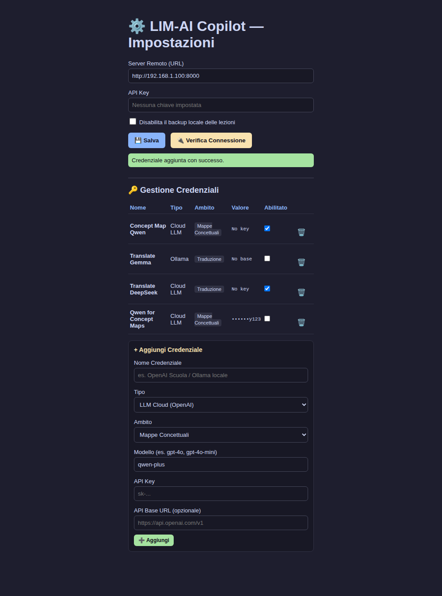

# Task 46-48 Verification Audit

## 1. Credential Pydantic Model (with scope field)
```python
class Credential(BaseModel):
    """Pydantic model representing LLM or Sketchfab provider credentials."""

    id: str
    name: str
    type: Literal["llm_cloud", "llm_ollama", "sketchfab"]
    scope: Literal[
        "global", "concept_map", "quiz_and_summary", "translation", "ocr"
    ] = "global"
    enabled: bool = False
    model: str | None = None
    api_key: str | None = None
    api_base: str | None = None
    access_token: str | None = None
```

## 2. Full body of enforce_mutual_exclusivity()
```python
def enforce_mutual_exclusivity(active_cred: Credential) -> None:
    # Resolve type group
    active_group = (
        "llm" if active_cred.type in ("llm_cloud", "llm_ollama") else "sketchfab"
    )
    active_scope = getattr(active_cred, "scope", "global")

    for c in settings.credentials:
        if c.id == active_cred.id:
            continue
        c_group = "llm" if c.type in ("llm_cloud", "llm_ollama") else "sketchfab"
        c_scope = getattr(c, "scope", "global")
        if c_group == active_group and c_scope == active_scope:
            c.enabled = False
```

## 3. Full body of get_outgoing_headers()
Note: `attach_active_credentials()` has been removed entirely from the codebase per headers-only propagation design.

```python
def get_active_llm_credential(action: str | None) -> Credential | None:
    """Resolves active LLM credential based on action scope with fallback to global."""
    scope_map = {
        "concept_map": "concept_map",
        "generate_quiz": "quiz_and_summary",
        "generate_summary": "quiz_and_summary",
        "transcribe_audio": "translation",
        "fast_ocr": "ocr",
        "ocr_vision": "ocr",
        "ocr": "ocr",
    }
    target_scope = scope_map.get(action, "global") if action else "global"

    # 1. Search for specifically scoped LLM credential that is enabled
    for c in settings.credentials:
        if (
            c.enabled
            and c.type in ("llm_cloud", "llm_ollama")
            and getattr(c, "scope", "global") == target_scope
        ):
            return c

    # 2. Fallback to 'global' scope
    if target_scope != "global":
        for c in settings.credentials:
            if (
                c.enabled
                and c.type in ("llm_cloud", "llm_ollama")
                and getattr(c, "scope", "global") == "global"
            ):
                return c

    return None


def get_outgoing_headers(action: str, payload_data: dict) -> dict:
    headers = {}

    # 1. LLM action check
    is_llm_action = action in (
        "concept_map",
        "generate_quiz",
        "generate_summary",
        "ocr_vision",
    )
    is_translation_stt = action == "transcribe_audio" and bool(
        payload_data.get("target_language")
    )

    if is_llm_action or is_translation_stt:
        active_llm = get_active_llm_credential(action)
        if active_llm:
            if active_llm.model:
                headers["X-LLM-Model"] = active_llm.model
            if active_llm.type == "llm_cloud" and active_llm.api_key:
                headers["X-LLM-API-Key"] = active_llm.api_key
            if active_llm.api_base:
                headers["X-LLM-API-Base"] = active_llm.api_base
        else:
            if is_llm_action:
                raise MissingCredentialsError(
                    "Nessuna credenziale LLM configurata e abilitata. Vai su /setup per aggiungerne una."
                )

    # 2. Sketchfab action check
    if action == "load_3d_model":
        active_sf = next(
            (c for c in settings.credentials if c.enabled and c.type == "sketchfab"),
            None,
        )
        if active_sf:
            if active_sf.access_token:
                headers["X-Sketchfab-Token"] = active_sf.access_token
        else:
            raise MissingCredentialsError(
                "Nessuna credenziale Sketchfab configurata e abilitata. Vai su /setup per aggiungerne una."
            )

    return headers
```

## 4. Full literal HTML/JS for "Ambito" scope selector added to daemon/setup.html
```html
    <div id="fields-scope" style="display: block;">
      <label>Ambito
        <select id="cred-scope" style="width:100%; box-sizing:border-box; padding:8px; margin-top:4px; border-radius:6px; border:1px solid #45475a; background:#181825; color:#cdd6f4;">
          <option value="global">Generale (fallback)</option>
          <option value="concept_map">Mappe Concettuali</option>
          <option value="quiz_and_summary">Quiz e Sintesi</option>
          <option value="translation">Traduzione</option>
          <option value="ocr">OCR (richiede un modello con supporto immagini, es. llama3.2-vision o gpt-4o)</option>
        </select>
      </label>
    </div>
```

```javascript
// Handler for adding a new credential
document.getElementById("add-cred-btn").onclick = async () => {
  const name = document.getElementById("cred-name").value.trim();
  if (!name) {
    alert("Inserisci un nome per la credenziale.");
    return;
  }
  const type = credTypeSelect.value;
  const body = { name, type, enabled: false };

  if (type === "llm_cloud" || type === "llm_ollama") {
    body.scope = document.getElementById("cred-scope").value;
  }

  if (type === "llm_cloud") {
    body.model = document.getElementById("cloud-model").value.trim() || "gpt-4o-mini";
    body.api_key = document.getElementById("cloud-key").value.trim() || null;
    body.api_base = document.getElementById("cloud-base").value.trim() || null;
  } else if (type === "llm_ollama") {
    body.model = document.getElementById("ollama-model").value.trim() || "ollama/llama3.1";
    body.api_base = document.getElementById("ollama-base").value.trim() || "http://localhost:11434";
  } else if (type === "sketchfab") {
    body.access_token = document.getElementById("sketchfab-token").value.trim() || null;
  }

  try {
    const r = await fetch("/api/credentials", {
      method: "POST",
      headers: { "Content-Type": "application/json" },
      body: JSON.stringify(body)
    });
    const res = await r.json();
    if (res.status === "created") {
      showResult(true, "Credenziale aggiunta con successo.");
      // Reset inputs
      document.getElementById("cred-name").value = "";
      document.getElementById("cloud-key").value = "";
      document.getElementById("cloud-base").value = "";
      document.getElementById("ollama-base").value = "";
      document.getElementById("sketchfab-token").value = "";
      await loadCredentials();
    } else {
      showResult(false, "Impossibile aggiungere credenziale.");
    }
  } catch (err) {
    showResult(false, `Errore durante il salvataggio: ${err}`);
  }
};
```

## 5. Vision-LLM OCR Research Finding & Associated Code

### Research Finding for Multimodal Image Format in LiteLLM
The official LiteLLM documentation specifies that vision-capable models (such as GPT-4o, Claude 3.5 Sonnet, Llama 3.2 Vision) require the OpenAI multimodal message format, where the message `content` is an array of objects. Text blocks are defined with type `"text"`, and images are defined with type `"image_url"`. The image URL accepts a base64 data URI (e.g. `data:image/png;base64,...`).
Source reference: https://docs.litellm.ai/docs/providers/openai#multimodal-gpt-4-vision-gpt-4o

### Literal Code in server/services/ocr_vision_service.py
```python
def generate_ocr_vision(
    image_base64: str, llm_model: str, llm_api_key: str | None, llm_api_base: str | None
) -> str:
    """
    Performs OCR on the provided base64-encoded image using a vision LLM.

    Args:
        image_base64: The base64-encoded image data.
        llm_model: The vision LLM model to use (e.g. gpt-4o).
        llm_api_key: Optional API key.
        llm_api_base: Optional API base.

    Returns:
        The transcribed text.
    """
    logger.info("Performing remote Vision-LLM OCR using model '%s'", llm_model)

    # Ensure correct data URI prefix for base64 image URL
    if not image_base64.startswith("data:"):
        image_url = f"data:image/png;base64,{image_base64}"
    else:
        image_url = image_base64

    prompt_text = (
        "trascrivi fedelmente il testo scritto in questa immagine, nient'altro"
    )

    messages = [
        {
            "role": "user",
            "content": [
                {"type": "text", "text": prompt_text},
                {"type": "image_url", "image_url": {"url": image_url}},
            ],
        }
    ]

    completion_args = {"model": llm_model, "messages": messages}
    if llm_api_key:
        completion_args["api_key"] = llm_api_key
    if llm_api_base:
        completion_args["api_base"] = llm_api_base

    try:
        response = litellm.completion(**completion_args)
        content = response.choices[0].message.content or ""
        return content.strip()
    except Exception as e:
        logger.error("Vision-LLM OCR completion call failed: %s", e, exc_info=True)
        raise e
```

### Literal Fallback-to-Tesseract code in daemon/local_bridge.py
```python
                        # 1. OCR Vision Dynamic Routing Exception:
                        # Check for an enabled credential with scope=="ocr". If found, send the image
                        # (base64) to the server action "ocr_vision" instead of running local Tesseract.
                        # If NOT found, or if the vision call fails, fall back to local Tesseract OCR.
                        active_ocr_cred = get_active_llm_credential("fast_ocr")
                        response_text = None
                        source_engine = "local_engine"

                        if capture_error is not None:
                            response_text = f"Cattura schermo fallita: {capture_error}"
                        elif active_ocr_cred and img is not None:
                            logger.info(
                                "Enabled 'ocr' scope credential found. Attempting remote Vision-LLM OCR..."
                            )
                            try:
                                import io
                                import base64

                                buffered = io.BytesIO()
                                img.save(buffered, format="PNG")
                                image_base64 = base64.b64encode(
                                    buffered.getvalue()
                                ).decode("utf-8")

                                ocr_vision_payload = {
                                    "action": "ocr_vision",
                                    "data": {"image_base64": image_base64},
                                }

                                remote_analyze_url = (
                                    f"{settings.remote_base_url}/api/v1/analyze"
                                )
                                req_headers = (
                                    {"Authorization": f"Bearer {settings.api_key}"}
                                    if settings.api_key
                                    else {}
                                )
                                custom_headers = get_outgoing_headers("ocr_vision", {})
                                req_headers.update(custom_headers)

                                response = await http_client.post(
                                    remote_analyze_url,
                                    json=ocr_vision_payload,
                                    headers=req_headers,
                                )
                                response.raise_for_status()
                                response_json = response.json()

                                if response_json.get("type") == "error":
                                    logger.warning(
                                        "Remote Vision OCR returned error response: %s. Falling back to Tesseract.",
                                        response_json.get("message"),
                                    )
                                else:
                                    response_text = response_json.get("text")
                                    source_engine = "remote_vision_llm"
                                    logger.info(
                                        "Successfully completed remote Vision-LLM OCR."
                                    )
                            except Exception as ve:
                                logger.error(
                                    "Remote Vision OCR call failed due to: %s. Falling back to Tesseract.",
                                    ve,
                                    exc_info=True,
                                )

                        # Fallback to local Tesseract if remote Vision OCR was not used or failed
                        if response_text is None:
                            if img is not None:
                                try:
                                    response_text = pytesseract.image_to_string(
                                        img
                                    ).strip()
                                    logger.info(
                                        "Screen capture successfully processed with Tesseract OCR (fallback/default)."
                                    )
                                except Exception as e:
                                    logger.error(
                                        f"Failed to perform local Tesseract OCR: {e}."
                                    )
                                    response_text = f"[OCR local fallback failed: {e}]"
                            else:
                                response_text = "[OCR failed: capture failed]"
```

## 6. Literal Names and One-Line Docstrings of New Test Functions Added

### `daemon/tests/test_credentials.py`
* `test_scoped_credential_mutual_exclusivity()`: "Tests that: 1. Enabling a scoped credential does not disable an unrelated-scope credential. 2. Enabling two credentials with the same scope correctly disables the first."
* `test_get_outgoing_headers_scoped_resolution_and_fallback()`: "Tests that scoped LLM credentials are dynamically resolved based on the requested action, with a fallback to the global LLM."

### `daemon/tests/test_local_bridge.py`
* `test_fast_ocr_routes_to_ocr_vision_when_credential_enabled()`: "Tests that fast_ocr routes to ocr_vision remote action when ocr scope credential is enabled."
* `test_fast_ocr_uses_local_tesseract_when_no_ocr_credential()`: "Tests that fast_ocr uses local Tesseract OCR directly if no ocr scope credential is enabled."
* `test_fast_ocr_falls_back_to_tesseract_when_vision_call_fails()`: "Tests that fast_ocr falls back to local Tesseract OCR if the remote Vision API call fails."
* `test_text_to_speech_model_path_unset()`: "Tests that text_to_speech action returns TTS_NOT_CONFIGURED error when PIPER_VOICE_MODEL_PATH is unset."
* `test_text_to_speech_model_file_missing()`: "Tests that text_to_speech action returns TTS_NOT_CONFIGURED error when PIPER_VOICE_MODEL_PATH is set but the file does not exist."
* `test_text_to_speech_success()`: "Tests that text_to_speech action executes Piper subprocess correctly and returns tts_audio payload on success."

### `server/tests/test_ocr_vision.py`
* `test_ocr_vision_service_multimodal_payload()`: "Tests that ocr_vision_service formats the multimodal payload correctly for LiteLLM."
* `test_ocr_vision_analyze_endpoint_success()`: "Tests that /api/v1/analyze handles 'ocr_vision' action successfully with credentials."
* `test_ocr_vision_analyze_endpoint_missing_credentials()`: "Tests that /api/v1/analyze returns MISSING_CREDENTIALS for 'ocr_vision' if model is not set."

## 7. Verification UI Screenshot Reference
The Setup UI was updated to include the scope dropdown selector and list column. The screenshot has been saved at:
`docs/task46-setup-ui-screenshot.png`


